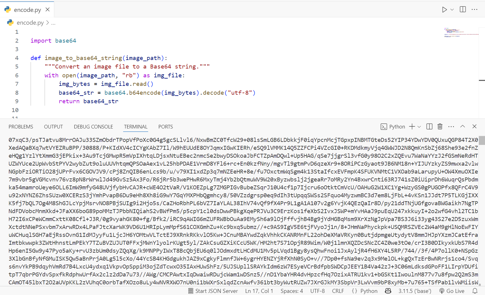

This project is a Flask-based web API that processes images of CNIC cards to extract text and detect faces using computer vision and OCR techniques. The system supports input either as a Base64 encoded image or as an uploaded image file, and it returns the extracted text and the detected face as a Base64 encoded image.

### Files Description:

1. **encode.py**
  This utility script reads an image file from a given path and converts it into a Base64 encoded string. This encoded string can be used to send image data over APIs or store it in text-based formats. It helps in preparing images for transmission in JSON or other text-based protocols where raw image files cannot be sent directly.

3. **input base64.py**
   This file contains the Flask API that accepts a POST request with a Base64 encoded image of a CNIC card. It decodes the Base64 string into an image, uses OpenCV to detect the face, extracts text using EasyOCR, and returns the extracted CNIC text and the detected face image encoded back in Base64 format.

4. **input image.py**
   This Flask API handles CNIC image uploads through file form-data. It reads the image file, detects faces and extracts text similarly using OpenCV and EasyOCR, then responds with the extracted text and the detected face image encoded as Base64. It supports multiple image formats and provides error handling for missing or invalid uploads.

5. **decode.py**
   This utility script decodes a Base64 encoded image string (for example, the face image returned by the APIs) back into an image format usable for display or saving. It helps in converting the Base64 string back to a normal image for further processing or viewing.

**Summary:**
The project leverages OpenCV's face detection and EasyOCR's text recognition to provide a reliable CNIC data extraction tool. It offers flexibility in input methods (Base64 or file upload) and outputs both textual data and facial images in Base64, making it easy to integrate with web or mobile clients.

 🔐 Note: This is a public demo overview. The full source code is available upon request. Contact me via LinkedIn https://www.linkedin.com/in/hinaasad-/ or email at hinaasad672@gmail.com.

